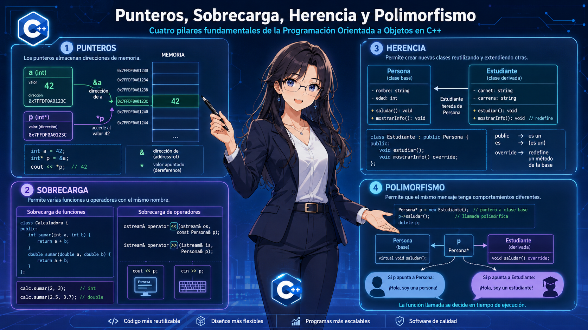
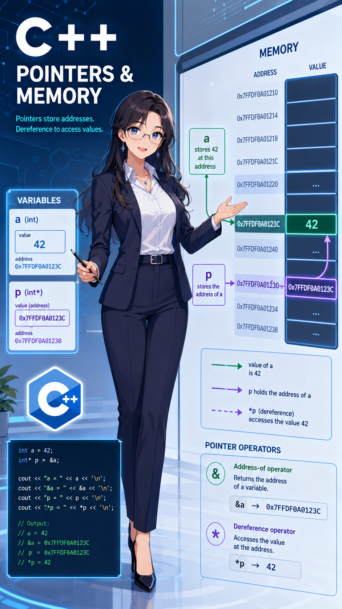
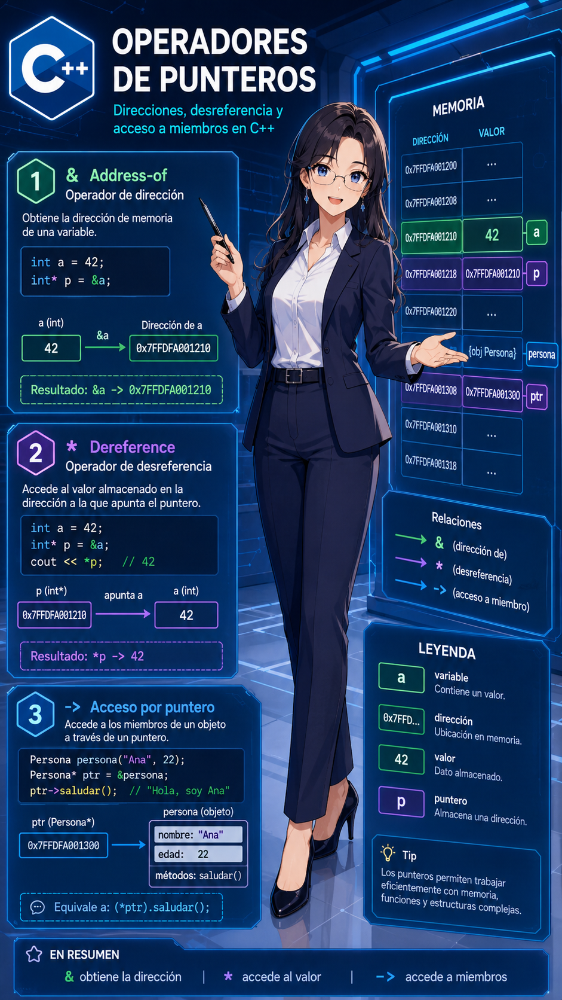
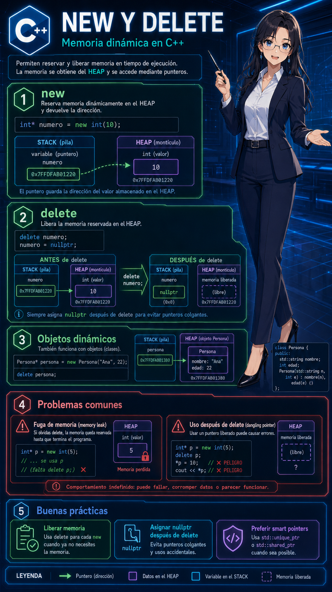
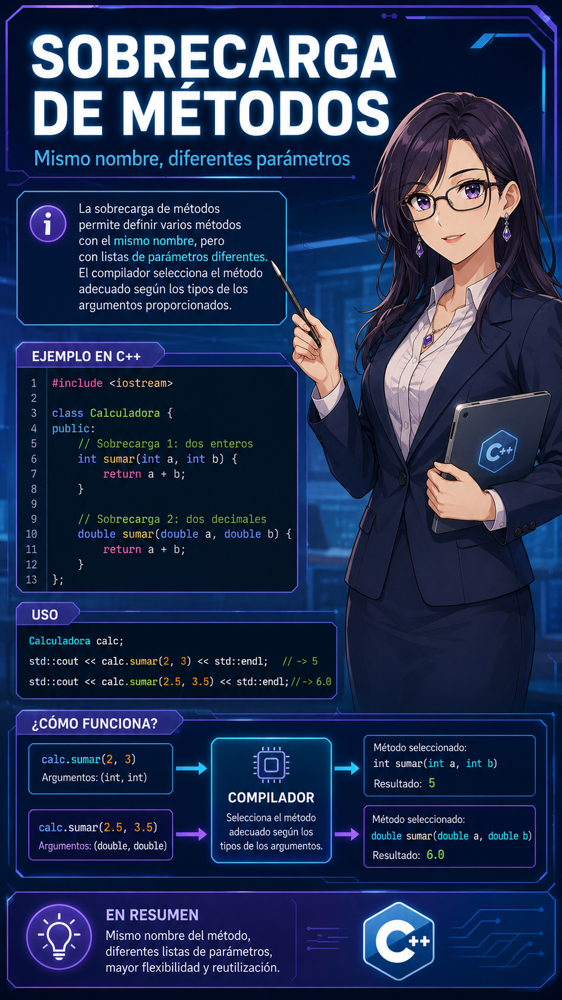
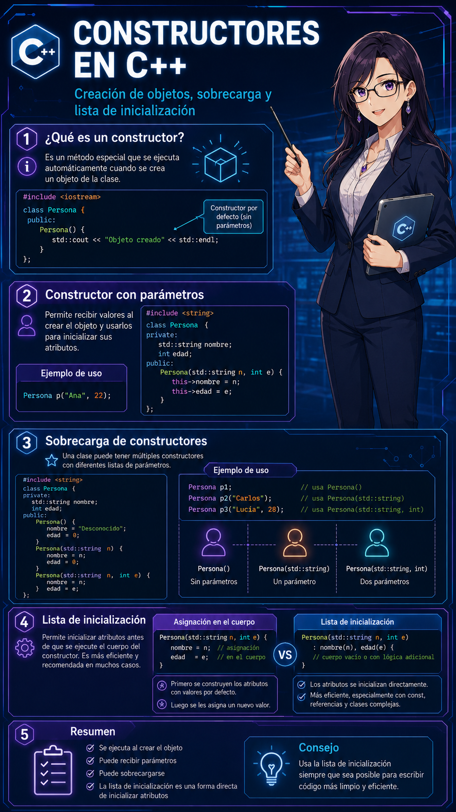
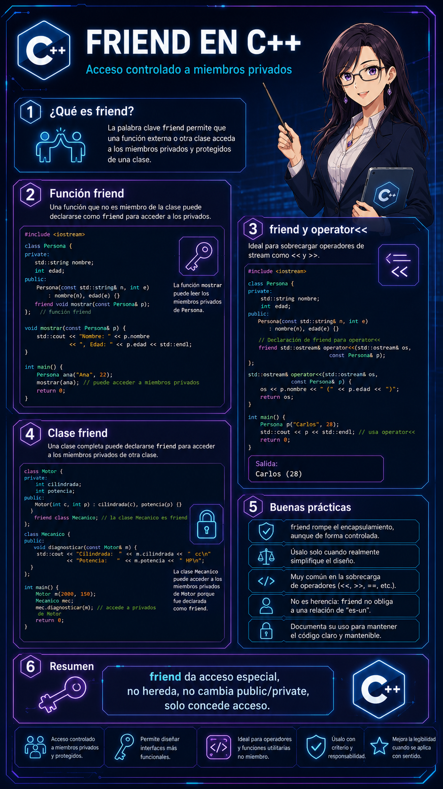
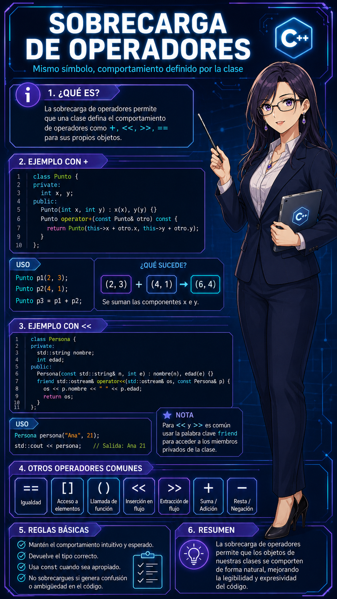
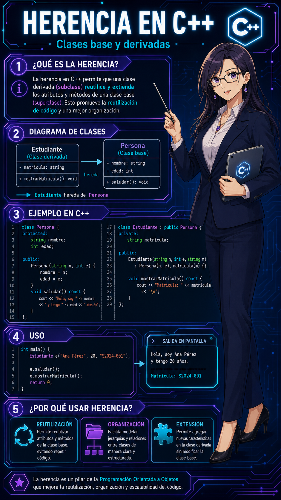
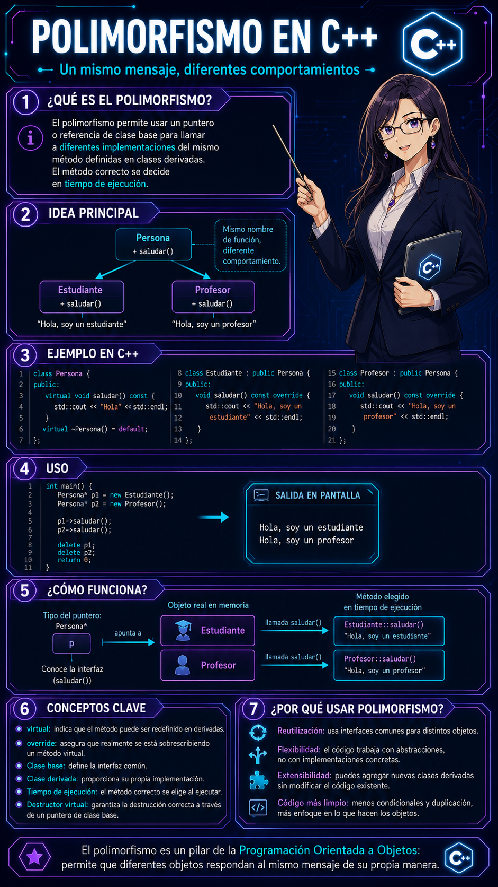

# Programación Orientada a Objetos

## YOEL ANDEYCI PILIER MARTINEZ

### [yapmartinez@oymas.edu.do](mailto:yapmartinez@oymas.edu.do)

---

# Punteros, Sobrecarga, Herencia y Polimorfismo



---

# Punteros



Un puntero es una variable que guarda una dirección de memoria.

```cpp
int edad = 20;

int* pEdad = &edad;
```

---

# Dirección y Valor


```cpp
int edad = 20;
int* pEdad = &edad;

std::cout << edad << std::endl;
std::cout << &edad << std::endl;
std::cout << pEdad << std::endl;
std::cout << *pEdad << std::endl;
```

---

# Operadores de Punteros



| Operador | Descripción |
|----------|-------------|
| `&` | Obtiene la dirección de una variable |
| `*` | Accede al valor guardado en esa dirección |
| `->` | Accede a miembros usando un puntero |

---
# Operadores de Punteros


```cpp
Persona persona("Juan", 20);

Persona* pPersona = &persona;

pPersona->saludar();
```

---

# Puntero Nulo


Un puntero nulo no apunta a ningún objeto válido.

```cpp
int* ptr = nullptr;

if (ptr != nullptr) {
    std::cout << *ptr << std::endl;
}
```

---

# new y delete



`new` reserva memoria dinámicamente.

`delete` libera esa memoria.

```cpp
int* numero = new int(10);

std::cout << *numero << std::endl;

delete numero;
numero = nunewdelete
```
---

# Objetos con new y delete


```cpp
Persona* persona = new Persona("Ana", 22);

persona->saludar();

delete persona;
persona = nullptr;
```

---

# Problemas de los Raw Pointers


Los punteros raw deben manejarse con cuidado.

- Si no usamos `delete`, la memoria queda ocupada.
- Si usamos un puntero después de `delete`, hay error.
- Si usamos `delete` dos veces, hay error.

---

# Punteros Inteligentes


Los punteros inteligentes ayudan a manejar la memoria automáticamente.

```cpp
#include <memory>
```

Los más usados son:

- `std::unique_ptr`
- `std::shared_ptr`
- `std::weak_ptr`

---

# unique_ptr


`std::unique_ptr` tiene un único dueño.

```cpp
#include <memory>

std::unique_ptr<Persona> persona =
    std::make_unique<Persona>("Juan", 20);

persona->saludar();
```

---

# shared_ptr


`std::shared_ptr` permite compartir el mismo objeto.

```cpp
#include <memory>

std::shared_ptr<Persona> p1 =
    std::make_shared<Persona>("Ana", 22);

std::shared_ptr<Persona> p2 = p1;

p1->saludar();
p2->saludar();
```

---

# weak_ptr


`std::weak_ptr` observa un objeto manejado por `std::shared_ptr`.

No aumenta el conteo de referencias.

El objeto se libera cuando ya no queda ningún `std::shared_ptr`.

---

# weak_ptr


```cpp
#include <memory>

std::shared_ptr<Persona> persona =
    std::make_shared<Persona>("Ana", 22);

std::weak_ptr<Persona> observador = persona;

persona.reset(); // Si no hay más shared_ptr, el objeto se libera.
```

---

# Uso Seguro de weak_ptr


Antes de usar un `std::weak_ptr`, debemos convertirlo temporalmente en `std::shared_ptr`.

```cpp
#include <memory>
#include <iostream>

std::shared_ptr<Persona> persona =
    std::make_shared<Persona>("Ana", 22);

std::weak_ptr<Persona> observador = persona;

if (std::shared_ptr<Persona> p = observador.lock()) {
    p->saludar();
} else {
    std::cout << "El objeto ya no existe";
}
```
---

# Raw Pointer vs Smart Pointer


| Raw Pointer                   | Smart Pointer                                            |
| ----------------------------- | -------------------------------------------------------- |
| Usa `new` y `delete`          | Usa `make_unique` o `make_shared`                        |
| El programador libera memoria | La memoria se libera automáticamente                     |
| Más fácil cometer errores     | Más seguro para manejar objetos                          |
| No controla propiedad         | Puede expresar propiedad única, compartida u observación |

---

# Sobrecarga de Métodos



La sobrecarga permite tener varios métodos con el mismo nombre.

La diferencia debe estar en los parámetros.

```cpp
class Calculadora {
public:
    int sumar(int a, int b) {
        return a + b;
    }

    double sumar(double a, double b) {
        return a + b;
    }
};
```
---

# Sobrecarga de Métodos


La sobrecarga permite tener varios métodos con el mismo nombre.

```cpp
Calculadora calc;

std::cout << calc.sumar(2, 3) << std::endl;
std::cout << calc.sumar(2.5, 3.5) << std::endl;

```

---

# Sobrecarga de Constructores



Una clase puede tener varios constructores.

```cpp
class Persona {
private:
    std::string nombre;
    int edad;

public:
    Persona() {
        this->nombre = "Sin nombre";
        this->edad = 0;
    }

    Persona(std::string n, int e) {
        this->nombre = n;
        this->edad = e;
    }
};
```

---

# Lista de Inicialización


También podemos inicializar los atributos antes del cuerpo del constructor.

```cpp
class Persona {
private:
    std::string nombre;
    int edad;

public:
    Persona(std::string n, int e)
        : nombre(n), edad(e) {
    }
};
```

---

# Constructor de Copia


El constructor de copia crea un objeto usando otro objeto existente.

```cpp
class Persona {
private:
    std::string nombre;
    int edad;

public:
    Persona(std::string n, int e) {
        this->nombre = n;
        this->edad = e;
    }

    Persona(const Persona& otra) {
        this->nombre = otra.nombre;
        this->edad = otra.edad;
    }
};

Persona p1("Juan", 20);
Persona p2 = p1;
```

---

# Constructor de Movimiento


El constructor de movimiento puede tomar los datos de un objeto temporal.

```cpp
#include <utility>

class Persona {
private:
    std::string nombre;
    int edad;

public:
    Persona(Persona&& otra) noexcept {
        this->nombre = std::move(otra.nombre);
        this->edad = otra.edad;
    }
};
```

---

# friend



`friend` permite que una función externa acceda a miembros privados de una clase.

```cpp
class Persona {
private:
    std::string nombre;
    int edad;

public:
    friend void mostrar(const Persona& p);
};

void mostrar(const Persona& p) {
    std::cout << p.nombre << std::endl;
}
```

---

# Sobrecarga de <<



`std::ostream` representa una salida.

```cpp
class Persona {
private:
    std::string nombre;
    int edad;

public:
    Persona(std::string n, int e) {
        this->nombre = n;
        this->edad = e;
    }

    friend std::ostream& operator<<(
        std::ostream& os,
        const Persona& p
    );
};
```
---

# Sobrecarga de <<


```cpp
std::ostream& operator<<(std::ostream& os, const Persona& p) {
    os << p.nombre << " " << p.edad;
    return os;
}

Persona persona("Juan", 20);

std::cout << persona << std::endl;
```

---

# Sobrecarga de >>


`std::istream` representa una entrada.

```cpp
class Persona {
private:
    std::string nombre;
    int edad;

public:
    Persona() {
        this->nombre = "";
        this->edad = 0;
    }

    friend std::istream& operator>>(
        std::istream& is,
        Persona& p
    );
};

```

---

# Sobrecarga de >>


```cpp


std::istream& operator>>(std::istream& is, Persona& p) {
    is >> p.nombre >> p.edad;
    return is;
}

Persona persona;

std::cin >> persona;
```

---

# Herencia



La herencia permite crear una clase usando otra clase como base.

```cpp
class Persona {
private:
    std::string nombre;
    int edad;

public:
    Persona(std::string n, int e) {
        this->nombre = n;
        this->edad = e;
    }

    void saludar() {
        std::cout << "Hola, soy "
                  << this->nombre
                  << std::endl;
    }
};
```

---

# Clase Derivada


```cpp
class Estudiante : public Persona {
private:
    std::string matricula;

public:
    Estudiante(
        std::string n,
        int e,
        std::string m
    ) : Persona(n, e) {
        this->matricula = m;
    }

    void mostrarMatricula() {
        std::cout << this->matricula
                  << std::endl;
    }
};
```

---

# Uso de Herencia


```cpp
Estudiante estudiante(
    "Ana",
    22,
    "2024-001"
);

estudiante.saludar();
estudiante.mostrarMatricula();
```

---

# Polimorfismo



El polimorfismo permite usar una clase derivada como si fuera una clase base.

```cpp
class Persona {
protected:
    std::string nombre;

public:
    Persona(std::string n) {
        this->nombre = n;
    }

    virtual void saludar() const {
        std::cout << "Hola, soy "
                  << this->nombre
                  << std::endl;
    }

    virtual ~Persona() = default;
};
```

---

# Sobrescritura de Métodos


```cpp
class Estudiante : public Persona {
public:
    Estudiante(std::string n)
        : Persona(n) {
    }

    void saludar() const override {
        std::cout << "Hola, soy el estudiante "
                  << this->nombre
                  << std::endl;
    }
};
```

---

# Uso de Polimorfismo


```cpp
Estudiante estudiante("Ana");

Persona* persona = &estudiante;

persona->saludar();
```

Aunque el puntero es de tipo `Persona*`, se ejecuta el método de `Estudiante`.

---

# Polimorfismo con Smart Pointer


```cpp
#include <memory>

std::unique_ptr<Persona> persona =
    std::make_unique<Estudiante>("Ana");

persona->saludar();
```
---

# Clases Virtuales Puras


Una clase con al menos un método virtual puro se vuelve una clase abstracta.

No se puede crear un objeto directo de esa clase.

```cpp
class Persona {
public:
    virtual void saludar() const = 0;

    virtual ~Persona() = default;
};

class Estudiante : public Persona {
public:
    void saludar() const override {
        std::cout << "Hola, soy estudiante";
    }
};

```
